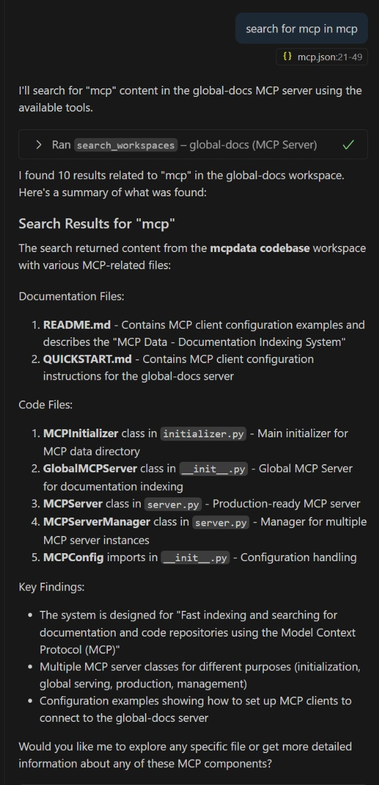
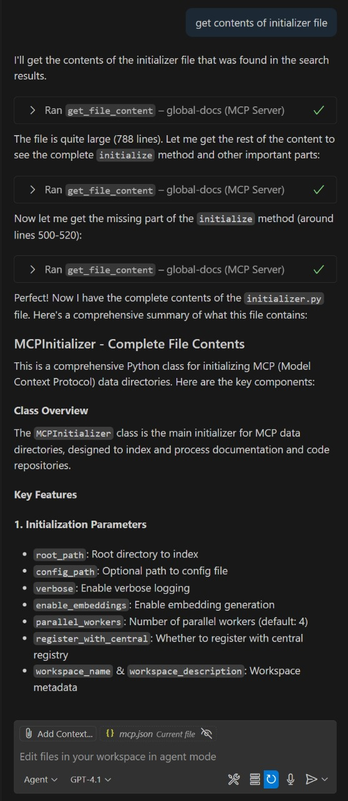

# Local MCP System

A comprehensive system for local documentation indexing and AI-powered search through MCP (Model Context Protocol). Enable AI assistants to search across all your documentation and code repositories from a single interface.

## 🚀 Quick Start

### 1. Install and Index
```bash
cd mcpdata
pip install -e .
mcpdata /path/to/your/docs --workspace-name "My Docs"
```

### 2. Start MCP Server
```bash
cd mcp-global-server
pip install -r requirements.txt
python server.py
```

### 3. Configure AI Client
```json
{
  "mcpServers": {
    "global-docs": {
      "command": "python",
      "args": ["C:\\path\\to\\localmcp\\mcp-global-server\\server.py"]
    }
  }
}
```

## 🎮 Examples

### Search Across Documentation and Code
**You:** "Search for mcp configuration"



### Get Complete File Contents
**You:** "Get the contents of the initializer file"



## 🏗️ Architecture

**localmcp** consists of two components:

1. **[mcpdata](src/README.md)** - Fast indexing engine
2. **[mcp-global-server](mcp-global-server/README.md)** - MCP server for AI

**Flow:** Index files → Create searchable database → AI searches via MCP

## 📊 What You Can Search

- **Documentation**: `.md`, `.rst`, `.txt`, `.adoc`
- **Code**: `.py`, `.js`, `.ts`, `.java`, `.cpp`, `.rs`
- **Config**: `.json`, `.yaml`, `.yml`, `.toml`

## 🔗 Documentation

- **[Complete Installation Guide](docs/INSTALLATION.md)**
- **[Configuration Options](docs/CONFIGURATION.md)**
- **[Troubleshooting Guide](docs/TROUBLESHOOTING.md)**
- **[Contributing Guide](docs/CONTRIBUTING.md)**

## 🎯 Use Cases

- **Documentation Teams** - Search across multiple doc repositories
- **Development Teams** - Find code patterns across repositories
- **Mixed Projects** - Unified search for docs + code

## 📜 License

MIT License - see [LICENSE](LICENSE) file for details.

---

**Ready to get started?** Follow the [Quick Start](#-quick-start) above or read the [Complete Installation Guide](docs/INSTALLATION.md).
