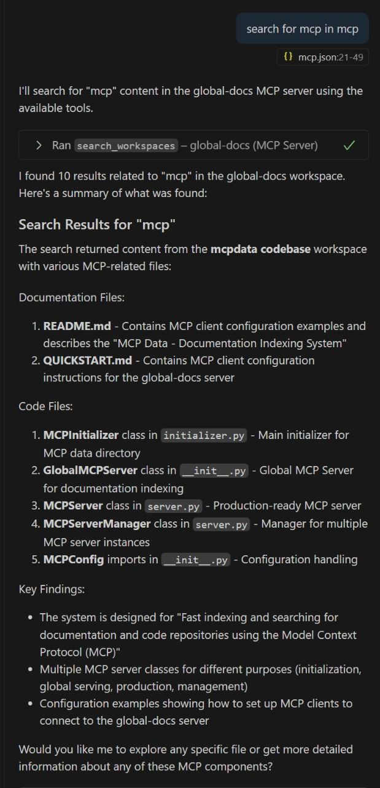
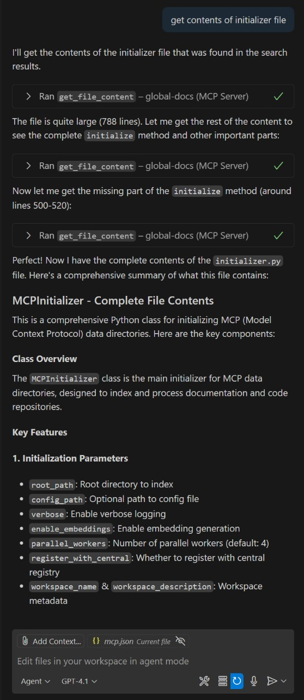

# Examples and Use Cases

Real-world examples of using the Local MCP System.

## 🎮 AI Conversation Examples

### Search Across Documentation and Code

**You:** "Search for mcp configuration"



*AI searches across all indexed workspaces and finds relevant documentation and code*

### Get Complete File Contents

**You:** "Get the contents of the initializer file"



*AI retrieves complete file contents with proper context and structure*

### Finding Code Implementation

**You:** "How does user authentication work in our system?"

**Behind the scenes:**
1. AI uses `search_workspaces("user authentication", search_type="code")`
2. Gets list of relevant files and functions
3. AI uses `get_function_content("src/auth.py", "authenticate_user")`
4. AI analyzes complete implementation and explains it

### Understanding Documentation

**You:** "What's the process for setting up the database?"

**Behind the scenes:**
1. AI uses `search_workspaces("database setup", search_type="docs")`
2. Finds relevant documentation sections
3. AI uses `get_file_content("docs/database-setup.md")` with file outline
4. AI presents step-by-step setup process

### Project Exploration

**You:** "What documentation do I have available?"

**Behind the scenes:**
1. AI uses `list_workspaces(include_stats=true)`
2. Gets complete workspace list with statistics
3. AI presents organized view of all available documentation

## 💡 Use Cases

### Documentation Teams

```bash
# Index technical documentation
mcpdata /docs/api --workspace-name "API Docs" --workspace-description "REST API documentation"
mcpdata /docs/user-guide --workspace-name "User Guide" --workspace-description "End-user documentation"

# AI can now search across all documentation instantly
```

**Benefits:**
- Search across multiple documentation repositories
- Find related topics across different documents
- Get instant answers without manual navigation

### Development Teams

```bash
# Index multiple repositories
mcpdata /src/backend --workspace-name "Backend" --workspace-description "Core backend services"
mcpdata /src/frontend --workspace-name "Frontend" --workspace-description "React frontend application"
mcpdata /src/mobile --workspace-name "Mobile" --workspace-description "Mobile application code"

# AI can find code patterns, functions, and relationships across all repos
```

**Benefits:**
- Find code patterns across repositories
- Locate function implementations quickly
- Understand relationships between services

### Mixed Projects

```bash
# Index entire project with code and docs
mcpdata /project --workspace-name "Full Project" --workspace-description "Complete project with documentation and code"

# AI gets unified view of project structure and content
```

**Benefits:**
- Unified search across code and documentation
- Understand how features are documented and implemented
- Get complete context for any question

## 🛠️ Advanced Examples

### Custom Configuration

```bash
# Using custom configuration
mcpdata /project \
  --config custom-config.json \
  --workspace-name "Custom Project"
```

## 🎯 Real Success Stories

### Documentation Team Lead
*"I can now search across 15 different documentation repositories instantly. The AI finds exactly what I need without me having to remember which repo contains what."*

### Senior Developer
*"Finding code patterns across multiple microservices is now trivial. The AI understands the context and shows me related functions automatically."*

### DevOps Engineer
*"Setting up took 5 minutes, and now our entire team can search all our technical documentation through ChatGPT."*

## 🔧 Integration Examples

### VS Code Integration

```json
{
  "mcpServers": {
    "local-docs": {
      "command": "python",
      "args": ["C:\\path\\to\\mcp-global-server\\server.py"]
    }
  }
}
```

### Claude Desktop Integration

```json
{
  "mcpServers": {
    "global-docs": {
      "command": "python",
      "args": ["C:\\path\\to\\mcp-global-server\\server.py"]
    }
  }
}
```

### Custom Client Integration

```python
import mcp

client = mcp.Client()
client.connect_to_server("python", ["path/to/server.py"])

# Search across workspaces
results = client.call_tool("search_workspaces", {
    "query": "authentication",
    "max_results": 10
})
```

## Next Steps

- [Install the system](INSTALLATION.md)
- [Configure for your needs](CONFIGURATION.md)
- [Get performance metrics](PERFORMANCE.md)
- [Troubleshoot issues](TROUBLESHOOTING.md)
